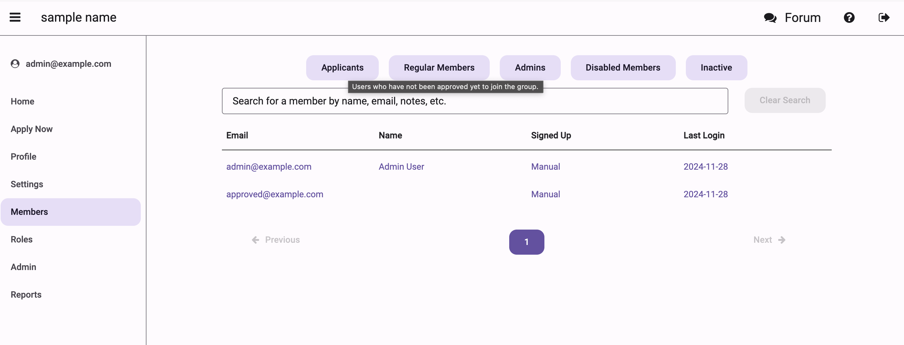
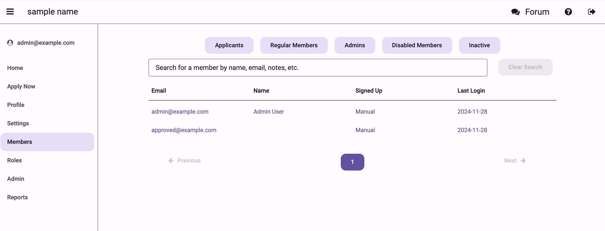
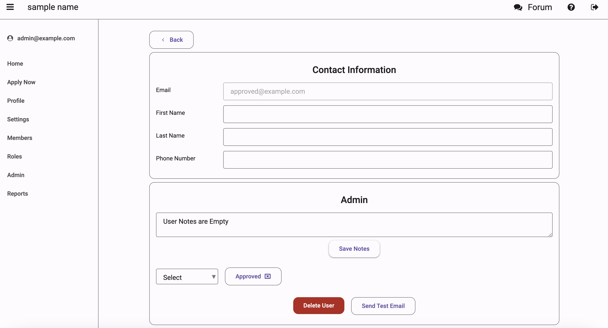
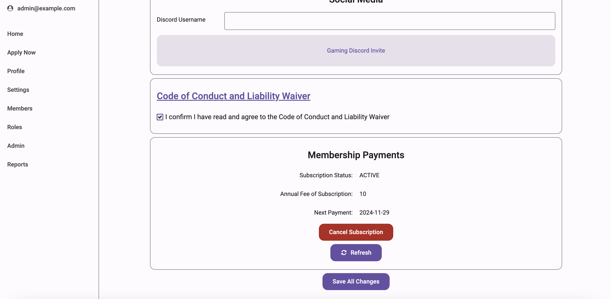

# Member Management Guide

This guide covers how to manage members in the Not Alone app, including handling applications, member removals, and maintaining member notes.

## Managing Applications

### Viewing Applications

Navigate to the Members screen and use the filter dropdown to view pending applications.

The filter allows you to view all pending applications.

### Reviewing Individual Applications

Click on an applicant to view their information:

### Application Actions

For each application, you can:
1. **Approve**
   - Grants member access
   - Triggers welcome email
   - Creates member profile

3. **Decline**
   - Sends rejection notification
   - Archives application
   - Records reason for decline (in the notes section)

## Managing Members

### Member Overview

The Members screen provides a comprehensive view of all members:

Features include:
1. Search functionality
2. Filter options
3. Status indicators

### Member Actions

#### Adding Notes
1. Select member profile
2. Scroll to the notes section
3. Enter note content
4. Click 'Save Notes'

#### Removal Process
1. Navigate to member profile
2. Click on each role to remove them and effectively remove the member from accessing your group.
3. Write a note and click "Save Notes"

### Member Details

The member details screen provides comprehensive information about each member:

You can view and manage member's personal information and contact details.

The roles section allows you to manage member access and permissions within your organization.

Additional member information including payment status can be found by scrolling down.
You can cancel payments for a member by clicking on 'Cancel Subscription'.
