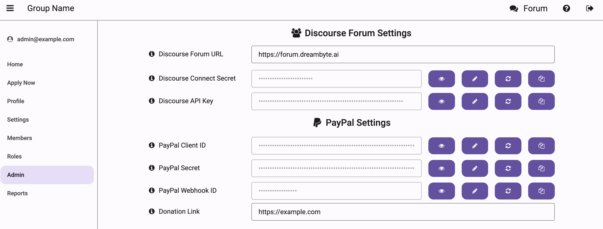
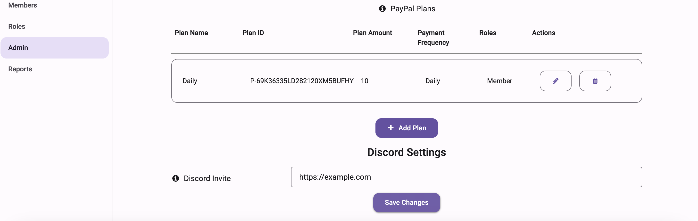
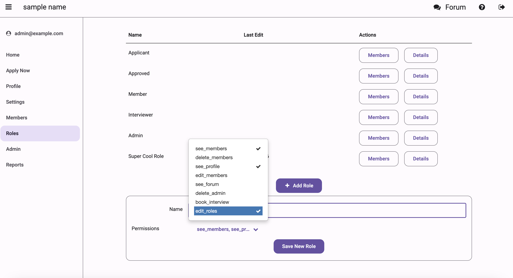

# Tenant Setup Guide

This guide walks you through setting up a new tenant in the Not Alone app, including PayPal integration, webhook configuration, and admin settings.

## Initial Setup

Before setting up your tenant, you must configure [Discourse](discourse_setup.md) and [PayPal](paypal_setup.md).

### 1. Basic Information

After logging in as a tenant admin, navigate to the Admin screen (`#app/admin`) and configure:

Organization Details:

- Organization name
- Contact email
- Upload organization logo
- Set waiver/terms document URL

Integration Settings:

- Discourse forum URL
- Discourse Connect secret (for authenticating users)
- Discourse API key (for automations)
- PayPal Client ID and Secret
- Payment webhook ID

PayPal Plan Settings

- Enter your PayPal plan information
- Enter Plan Name, Plan ID (from PayPal), frequency, etc.
- Assign roles to members who pay through this subscription.

Discord invite link (optional)

### 2. Role Configuration

Set up roles for your organization:

1. Navigate to Roles section
2. Some basic roles are already defined and not editable. To create custom roles, see below.

For each role, configure:

- Role name
- Associated permissions
- Upload role guide document (if applicable)

By clicking on 'Details' in the Roles screen, you can see which permissions belong to each role.
You can also see (end edit) which files are attached for each role. These files serve as guides.

Configure permissions for different roles:

Basic Permissions:

- `see_members`: View member list
- `edit_members`: Modify member details
- `see_forum`: Access community forum
- `see_financials`: View financial reports

Administrative Permissions:

- `delete_admin`: Full administrative access
- `delete_members`: Ability to delete members

