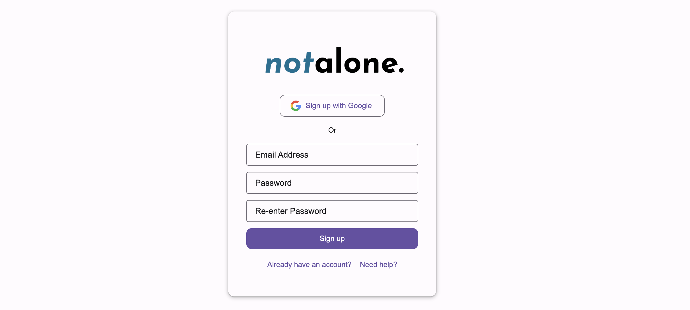
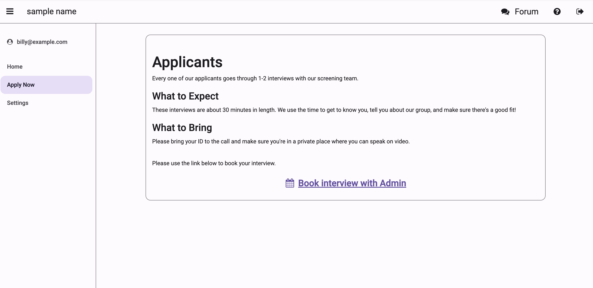
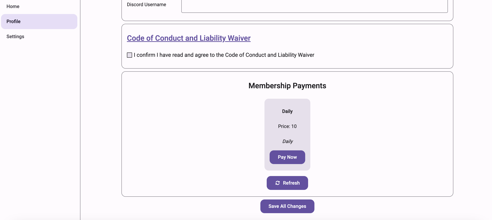
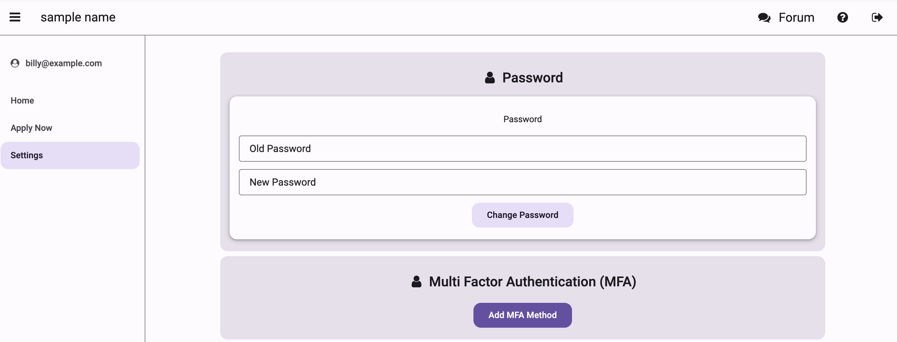

# Getting Started with Not Alone

This guide will walk you through the process of joining and using the Not Alone platform.

## Signing Up

When you first visit Not Alone, you'll be presented with our clean, simple login interface:

### Google Sign-Up (Recommended)
1. Click the "Sign in with Google" button at the top of the form
2. Select your Google account or enter your Google credentials in the popup window
3. Grant necessary permissions if prompted
4. You'll be automatically logged in and redirected to the next step

### Email Sign-Up
1. Click the "Sign up" link below the sign-in form
2. Fill out the registration form:
   - Enter your email address
   - Create a strong password
   - Re-enter your password to confirm
3. Click the "Sign up" button
4. Check your email for a verification link
5. Click the verification link to activate your account

## Application Process

If your group requires an application:

1. Fill out the application form with relevant information, including booking an interview if needed as shown in the screenshot
2. Submit your application
3. Wait for review by group administrators

## Profile Setup

After verifying your account, you'll need to complete your profile:

Fill out the required information:
    - Full name
    - Phone number
    - Discord username (optional)

Consent to the code of conduct (linked)

Subscribe to membership payments (if your group requires it)

## Consent Agreement

Before accessing group features, you must review and accept the consent form:

1. After completing your profile, you'll be presented with the consent document
2. Read through all sections carefully
3. Check the box at the bottom to indicate your agreement

## Interview Process (If Required)

Some groups require an initial interview. If this applies to your group:

1. Click on the link on the 'Apply' screen.
2. Select an available time slot from the calendar
3. Confirm your appointment
4. You'll receive an email confirmation with:
   - Interview date and time
   - Any preparation instructions
   - Link for virtual meetings (if applicable)

## Payment Process (If Required)

If your group requires a membership fee:

1. Navigate to the payment section in your profile
2. Review the fee structure
3. Choose your payment method:
   - Credit/Debit card
   - PayPal (if available)
   - Other available options
4. Complete the secure payment process
5. Keep your receipt for your records

## Settings and Preferences

You can customize your account settings at any time:

1. Access your settings through the menu
2. Change your password
3. Set up multi-factor authentication

## Accessing the Forum

Once all requirements are met (profile, consent, interview if required, and payment if required):

1. Click the Forum tab in the main navigation menu
2. You can then:
    - Browse existing discussions
    - Create new topics
    - Reply to other members
    - Follow topics of interest
